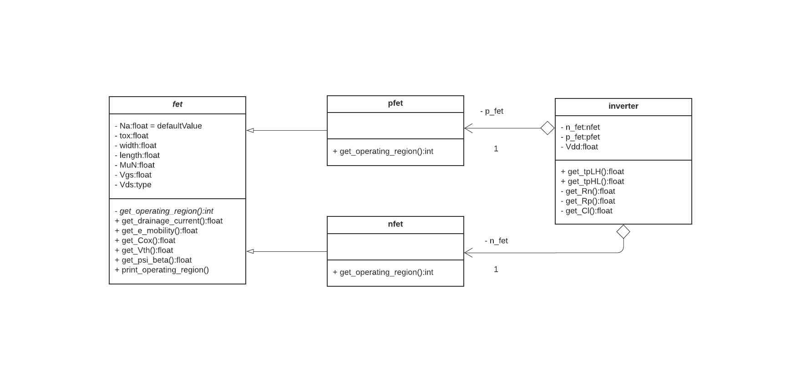

# funwithfets
Dyamic C++ library for simulating the behavior of MOSFETs. Designed as a study aid for ECE 3030 and as practice applying OOP principles. Allows you to instantiate models of PFETs, NFETs and Inverters and calculate various qualities based on their specs.
### UML Class Diagram

